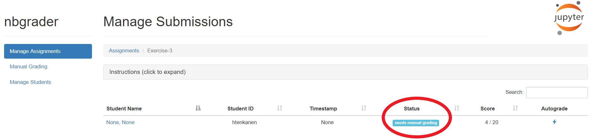
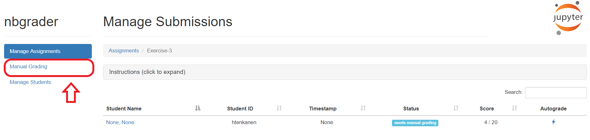
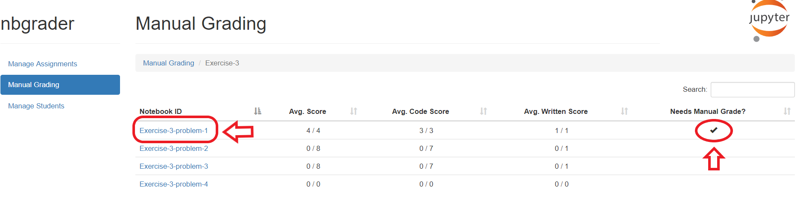
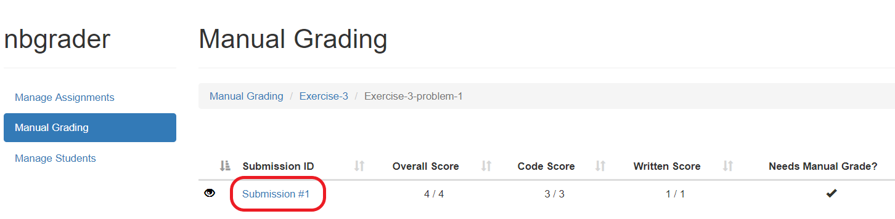
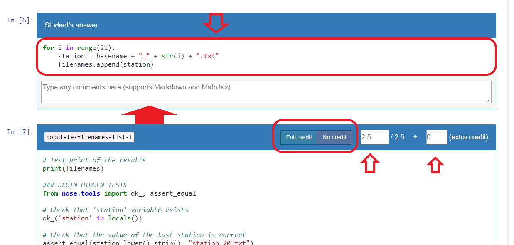
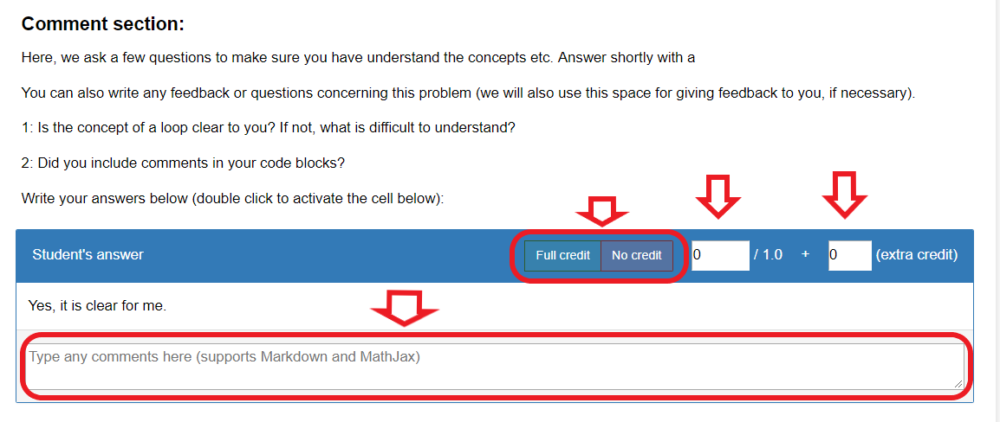

# Tools for autograding

This repository contains a few scripts that helps to manage Geo-Python and AutoGIS Exercises.
This is a simplified version of the original gradertools developed by Henkka: https://github.com/geo-python/gradertools 

what is different compared with the original tool:
- folder structure (less subfolders)
- separate steps for pulling student repo and fetching exercise templates
- no printing to pdf or sending feedback via slack.

## Workflow

Basic workflow consists of the following steps:
1. Change settings in the `gradertools/graderconfig/tools_conf.py` -file (list of students, and list of exercises)
2. Pull student repos using `gradertools/pull_student_repos.py`
3. Pull exercise templates using `gradertools/pull_exercise_repos.py`
4. Open Jupyter Notebook + nbgrader (run `jupyter notebook` on command line in the root-folder)
5. Do the autograding in the formgrader (press the lightning-button for each student)
5. Check submissions manually if needed and add written feedback
6. Provide feedback to students

If using this tool for the first time, check the requirements, and instructions on how to set things up for the first time below.

## Contents

- [Requirements](#requirements)
- [Setting up things for the first time](#setting-up-things-for-the-first-time)
- [Automate pulling repos](#automate-pulling-repos)
- [Grade student assignments](#grading-student-assignments)
  - [Autograde assignments](#grade-assignments-automatically)
  - [Grade assignment manually / modify credits from autograding](#grade-assignments-manually-or-modify-given-credits)
- [Generate feedback reports](#generate-feedback-reports)
- [Send feedback to Slack automatically](#send-feedback-reports-to-students-in-slack)

## Requirements

### Cache your GitHub credentials

These tools require that the GitHub credentials (username and password) are cached in your computer.
See directions how to do that from [here](cache_git_credentials.MD).

### Install packages.

The tools requires a few packages that needs to be installed before using them.

 - [**gitpython**](https://gitpython.readthedocs.io/en/stable/) package:

    ```conda install -c conda-forge gitpython```

 - [**nbgrader**](https://nbgrader.readthedocs.io/en/stable/) is essential for automatic grading and you can install it with conda:
    *check that you get nbgrader 0.6.0!*
    
    ```
    conda install jupyter
    conda install -c conda-forge nbgrader
           
    ```
    
  -  [**jinja2**](http://jinja.pocoo.org/docs/2.10/) (merges html files), should come with Anaconda but if not, install:

    ```conda install -c conda-forge jinja2 ```

## Folder structure

Nbgrader makes a couple of assumptions about how organize the assignment files. Read more about the nbgrader philosophy in [here](https://nbgrader.readthedocs.io/en/stable/user_guide/philosophy.html). 

All you need to do when starting is to create a root folder (eg. `autograding-2019` and clone this repository (`gradertools`) in there. When running the grading tools, they automatically create the folders `release`, `source` and `submitted` if they don't exists. 

```
───autograding-2019               # Create this folder yourself! Always start Jupyter Notebooks + nbgrader in this folder
   ├───gradertools                # Tools repository cloned from GitHub. 
   │   ├───graderconfig           # Configuration files. Set list of students and exercises in tools_conf.py in here.
   ├───release                    # Student version of exercises.
   │   └───Exercise-2
   ├───source                     # Teacher's versions of exercises with hidden tests etc.
   │   └───Exercise-2
   └───submitted                  # Student's submissions
       ├───saratodorovic
       │   └───Exercise-2         
       └───VuokkoH
           └───Exercise-2

```

## Setting up things for the first time

When doing this for the first time, you basically need to create a root folder where all the course assignments,
feedbacks etc. will be collected.

This can be for example (as set in these scripts):

 ```
 # Base folder
 C:\HY-DATA\...\Geo-Python\autograding-2019
 ```

When you have created the base folder for your exercises, you **need to clone this `gradertools` repository** into the base folder:

 ```
 cd C:\HY-DATA\...\Geo-Python\autograding-2019

 git clone https://github.com/geo-python-2019/gradertools

 ```


After you have succesfully cloned the repository, you can **initilize the nbgrader for the first time** 
by running [init_gradertools.py](init_gradertools.py) (you only need to do this once when using the environment for the very first time!).

You can run the tool directly from the root folder (one level up from the gradertools-repo):

 ```
 python gradertools/init_gradertools.py
 
 ```

OR you can navigate to the gradertools repo that you just cloned and run `init_gradertools.py`:

 ```
 
 cd gradertools
 python init_gradertools.py
 
 ```

This will run some tests and initialize your grading environment. If everything is okay, the program will say that you are good to go,
otherwise it will give you hints about what you need to do, to get things working. You need to do this step only once.

After this step, you are ready to start pulling student repos and start grading the exercises (separate instructions below)!

## Automate pulling repos

### Configuration

The tool is managed from [gradertools/graderconfig/tools_conf.py](graderconfig/tools_conf.py) file, where you can specify all the required parameters, such as:

```python

  # GitHub Organization where the exercises will be stored
  organization = "Geo-Python-2019"

  # Suffix for source repository for autograded Exercises
  autograding_suffix = "-autograding"

  # List of GitHub usernames that should be pulled (e.g. ['htenkanen', 'VuokkoH', 'davewhipp']
  user_names = ['VuokkoH', 'saratodorovic']

  # List of exercise numbers to pull (e.g. [3], or [3,4,5] if fetching multiple)
  exercise_list = [2,3]

  # Additional Classroom repos (e.g. ['final-assignment'])
  additional_classroom_repos = []

  # Extra repos from the organization (not a Classroom repo, e.g. ["Grades"])
  extra_repos = [] 

  # Convert GitHub repository name to format supported by NBgrader (True | False)
  use_nbgrader_style = True

  # Generate pdf from the feedback
  generate_pdf = False # disabled!
```  

### Pull student repos

[gradertools/pull_student_repos.py](pull_exercise_repos.py) is a script that helps to pull multiple repositories for specified students.
It also manages everything in a way that the student repositories can be automatically graded with NBgrader (renames folders etc.). 
Compliance with NBgrader  requires a few special tricks (done automatically by the tool):

 - This tool will create a folder called `submitted` which is where the student's assignments are organized and stored.
 - The GitHub Classroom repository that is pulled will be renamed from `exercise-3-username` to `Exercise-3`
 - On Windows computers, the tool sets file permissions related to `.git` (otherwise nbgrader will throw an error)
 

### How to run?

After you have configured everything in the ``tools_conf.py`` file (see above), you can run the tool from terminal or command prompt.

Run the tool from the root-folder:

```
python gradertools\pull_student_repos.py
```

OR from the gradertools-folder:

```
cd C:\HY-DATA\...\Geo-Python\autograding-2019\gradertools
python pull_student_repos.py
```

*Note: pull student repos pulls the student repos to subfolders in \autograding-2019\submitted\ ! Folder "submitted" is created if it does not exits*


### Pull exercise repos


 - This tool will create folders called `source` and `release` for the exercise templates if they don't exist.
 - The tool clones the autograding repository for assignments listed in `tools_conf.py` into `source`-folder and generates the student version into `release` folder
 - autograding repositories are renamed from `exercise-3-username` to `Exercise-3` in order to match the template with student submissions 

```
python gradertools\pull_exercise_repos.py
```

OR from the gradertools-folder:

```
cd C:\HY-DATA\...\Geo-Python\autograding-2019\gradertools
python pull_exercise_repos.py
```

## Grading student assignments

Once, you have pulled GitHub repositories using `pull_student_repos.py` and `pull_exercise_repos.py`, you can autograde them using nbgrader. 
Notice, that most of our **exercises include also manual grading** such as checking that the students have answered to the questions, and commented their code etc.

### Start Nbgrader

Assuming that you have installed the nbgrader package, you should see it when opening a jupyter notebook instance.
First, make sure that you are located in the root-folder of your autograding environment (eg. `..\autograding-2019`) - one level up from the gradertools-repository.

```
cd C:\HY-DATA\...\Geo-Python\autograding-2019
jupyter notebook
```

Jupyter notebook interface should open up automatically in a browser-window.

### Grade assignments automatically

0. Open the nbgrader tab:


1. From the nbgrader dashboard you will see the number of submissions (see below), and pressing that number, you will be directed to a new page where you can do the autograding for all the submissions by pressing the "lightning" -button


2. Once you have clicked the 'autograding' button (below), nbgrader will automatically grade the exercise, and it will create a new version of the students notebook submission under `autograded` folder. E.g. `../autograded/htenkanen/Exercise-3/Exercise-3.ipynb`

    - nbgrader will also automatically collect all the exercise points of the students into a database, so you don't need to do this manually
    


### Grade assignments manually or modify given credits

Typically exercises also contain cells that require manual grading, or there might be situations
where you need to add comments to the students answers or code, or modify the points given by the
automatic grading system. Luckily, this is easy to do with nbgrader.

1. Typically you can see from Nbgrader dashboard information that the assignment requires manual grading:



2. If the exercise requires manual grading, you can do that by opening the **Manual Grading** -tab:



3. On the following page you can see the overview of the assignments and there should also be a symbol indicating which of the
problems need manual grading (we always ask questions, so do check.). Click the link for each problem:



4. On the following page, you will see the current credits of that specific problem. Click the `Submission` button to start manual grading:



5. After this, you will land to the manual grading page, where you can manually modify credits for each task, and add comments for students codes. Giving feedback for students is important!:



6. There are also sections that cannot be automatically graded, such as written answers to our questions. Those you need to assess yourself and give credits according the grading criteria (discuss with instructors):



That's it! This is the basic workflow for grading the students exercises with nbgrader. "Enjoy!" :P

## Generate feedback reports

Once you have done grading, it is time to generate feedback reports for the students.
You can generate the feedback in the nbgrader interface, or then use a dedicated python script for generating the feedback.

** TO DO : WE ARE CURRENTLY AUTOMATING THE WORKFLOW OF ADDING POINTS AND FEEDBACK TO STUDENT REPO README.MD FILES**
** TO DO : UPDATE DOCS BELOW**
For this purpose, we have a dedicated tool [gradertools/generate_feedback.py](generate_feedback.py)
that automates the process. What this tools does:

 - It triggers nbgrader's feedback functionality, i.e. `$ nbgrader feedback ...` that produces feedback html files into `feedback` folder.
 - It collects all separate feedback html files (one for each problem), and merges them together so that we can share only 1 html with students (instead of multiple)
 - It generates pdf-report from that merged html-files that can be easily shared with students in Slack

### How to use the tool?

The tool uses by default the same settings than the `pull_student_repos.py` tool. Hence, you don't necessarily need to do any changes.
If you still need to do some changes you can configure this from [gradertools/graderconfig/tools_conf.py](graderconfig/tools_conf.py).

After configuring you can run the tool from command line (you need to be in the directory where the Python file is located):

```bash
$ python generate_feedback.py
```

## Send feedback reports to students in GitHub

**TO DO: UPDATE DOCS FOR PROVIDING FEEDBACK**

Final step after grading and generating the feedback reports, is to share those reports to students.
Generally, we provide the feedback in the README.MD file of the student repositories.


